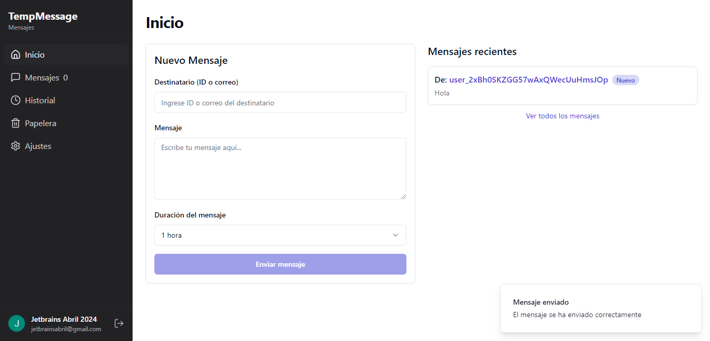
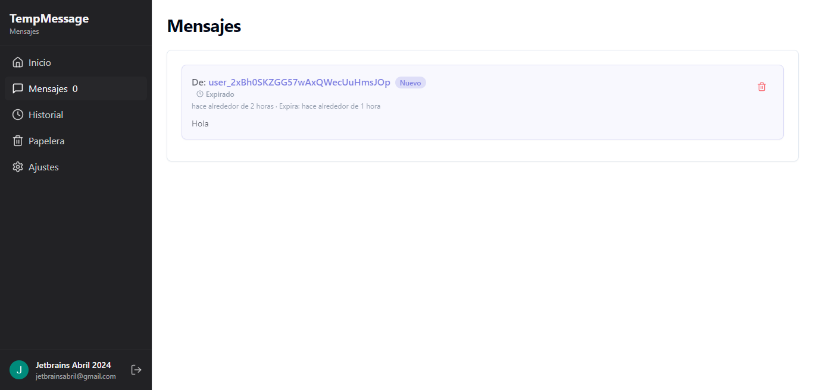
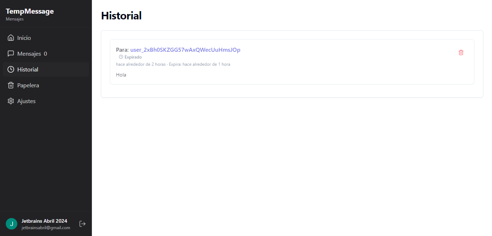
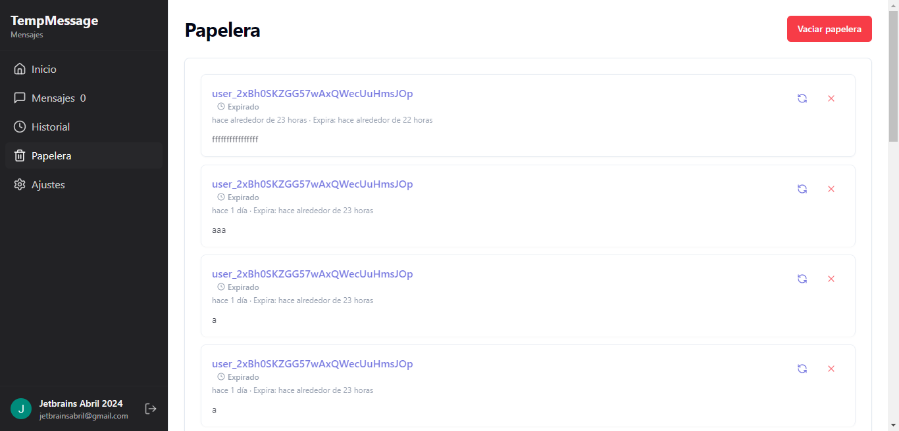
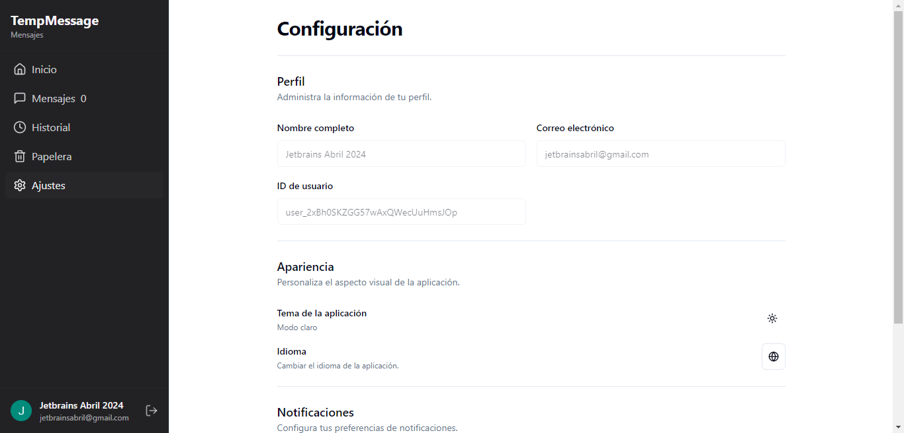
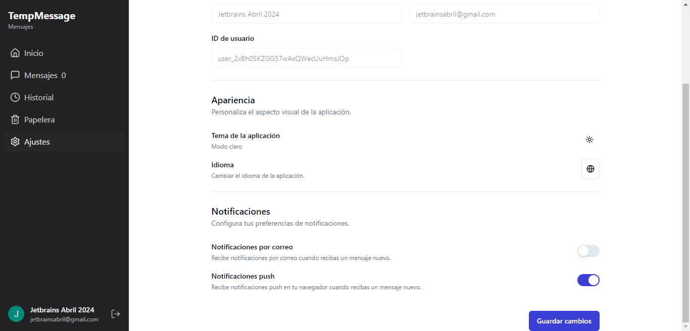

# 📨 Temporal Messages

Welcome to **Temporal Messages**, a web application designed for managing temporary messages with a clean and user-friendly interface.

🌐 **Live Demo**: [https://temporal-messages.netlify.app/](https://temporal-messages.netlify.app/)

---

## 📋 Index

1. [📖 Project Description](#-project-description)
2. [🖼️ Screenshoots](#-screenshoots)
3. [🔑 Using Clerk in the Project](#-using-clerk-in-the-project)
4. [🛠️ Technologies Used](#️-technologies-used)
5. [🚀 Deployment Guide](#-deployment-guide)
6. [🐳 Docker Compose Setup](#-docker-compose-setup)

---

## 📖 Project Description

**Temporal Messages** is a React-based web application that allows users to send, receive, and manage temporary messages. It features a sidebar navigation, real-time updates for unread messages, and user authentication powered by Clerk. The app is designed to be responsive and intuitive, making it easy for users to manage their messages efficiently.

---

## 🖼️ Screenshoots

### 1. **Home Page**

The home page provides an overview of the application. It includes a welcoming message and quick access to the main features.

### 2. **Messages Page**

The messages page displays all received messages. It shows unread messages with a badge and allows users to view message details.

### 3. **History Page**

The history page lists all previously sent or received messages, providing a complete log of user activity.

### 4. **Trash Page**

The trash page contains deleted messages. Users can restore or permanently delete messages from this section.

### 5. **Settings Page**


The settings page allows users to customize their profile, update preferences, and manage account settings.
---

## 🔑 Using Clerk in the Project

Clerk is used for user authentication and management in this project. Here's how it works:

1. **User Authentication**: Clerk handles user sign-in, sign-up, and session management seamlessly.
2. **User Data**: The `useUser` hook from Clerk provides access to the authenticated user's data, such as `id`, `fullName`, `emailAddress`, and `imageUrl`.
3. **Sign-Out**: The `SignOutButton` component from Clerk allows users to log out securely.

Clerk simplifies the integration of authentication, making it easy to manage user sessions and data.

---

## 🛠️ Technologies Used

This project is built using the following technologies:

- **React**: Frontend framework for building the user interface.
- **TypeScript**: Adds type safety to the project.
- **Clerk**: Authentication and user management.
- **Supabase**: Backend-as-a-service for real-time data and database management.
- **React Router**: For navigation and routing.
- **i18next**: For internationalization and translations.
- **Lucide Icons**: For modern and customizable icons.
- **Vite**: Development environment and build tool.
- **Tailwind CSS**: For styling and responsive design.

---

## 🚀 Deployment Guide

To deploy this project, follow these steps:

1. **Install Dependencies**:
   ```bash
   npm install
    ```
   
2. **Set Up Environment Variables**:
   Create a `.env` file in the root directory and add the following variables:
   ```bash
    # Clerk Authentication
    VITE_CLERK_PUBLISHABLE_KEY=<your_clerk_publishable_key_here>
    VITE_CLERK_SECRET_KEY=<your_clerk_secret_key_here>
    
    # Supabase
    VITE_SUPABASE_URL=<your_supabase_url_here>
    VITE_SUPABASE_ANON_KEY=<your_supabase_anon_key_here>
   
3. **Run the Development Server**:
   ```bash
    npm run dev
    ```
    Open your browser and navigate to `http://localhost:5173` to view the application.
4. **Build for Production**:
   ```bash
   npm run build
   ```